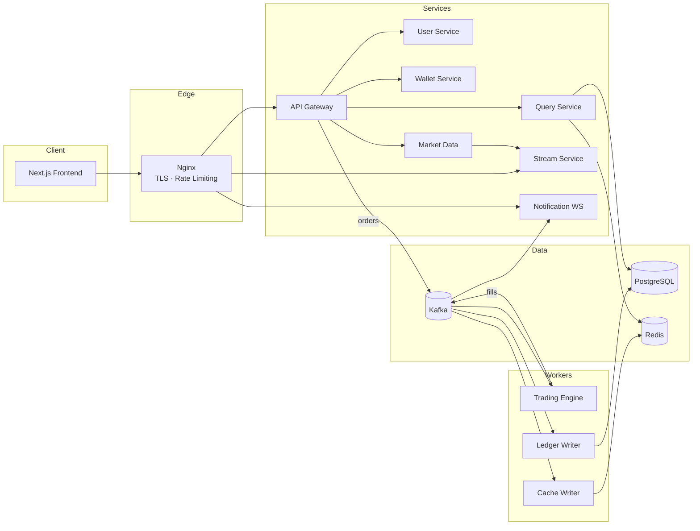

# 📈 TradingSimulator

> Полнофункциональная платформа криптобиржи для бумажной торговли — реальные рыночные данные, виртуальные деньги, архитектура промышленного уровня.

[](https://github.com/huanjou/TradingSimulator/actions/workflows/ci.yml)
[](LICENSE)
[](https://www.python.org/)
[](https://www.typescriptlang.org/)
[](https://docs.docker.com/compose/)

<!-- TODO: add screenshot -->
<!--  -->

---

## ✨ Возможности

- 🔐 **JWT-аутентификация** — access-токены на 15 минут + refresh-токены на 7 дней в HttpOnly-cookies, управление сессиями
- 📊 **Рыночные и лимитные ордера** — полный жизненный цикл ордера с матчинг-движком на базе Kafka
- ⚡ **Стриминг в реальном времени** — живые цены и стаканы ордеров через WebSocket / SSE
- 📉 **Графики TradingView** — OHLCV-свечи на основе `lightweight-charts`
- 💰 **Виртуальные кошельки** — пополнение / вывод с механикой hold & release
- 🔔 **Живые уведомления** — исполнения ордеров и изменения статусов через WebSocket
- 🔍 **Полная наблюдаемость** — Prometheus, Grafana, Loki, Jaeger, OpenTelemetry из коробки
- 🚀 **Деплой одной командой** — dev- и prod-стеки через Docker Compose + GitHub Actions CD

## 🏗 Архитектура

Событийно-ориентированные микросервисы с Kafka в качестве основы и разделением в стиле CQRS между путём записи (торговый движок → леджер) и путём чтения (query-сервис на базе Redis).



| Сервис              | Стек                          | Ответственность                                              |
| ------------------- | ----------------------------- | ------------------------------------------------------------ |
| **frontend**        | Next.js 14, Zustand, Tailwind | Торговый UI, графики, потоки аутентификации                  |
| **api-gateway**     | FastAPI                       | Маршрутизация, auth-middleware, ограничение частоты запросов |
| **user-service**    | FastAPI                       | Регистрация, вход, JWT, сессии                               |
| **wallet-service**  | FastAPI                       | Виртуальные балансы, hold/release                            |
| **trading-engine**  | Python + Kafka                | Сопоставление ордеров (рыночные + лимитные)                  |
| **ledger-writer**   | Python + Kafka                | Расчёты по сделкам → леджер в PostgreSQL                     |
| **cache-writer**    | Python + Kafka                | Синхронизация ордеров/сделок в Redis                         |
| **query-service**   | FastAPI + gRPC                | Запросы только на чтение (ордера, сделки, позиции)           |
| **market-data**     | FastAPI                       | Живые цены криптовалют, OHLCV-свечи                          |
| **stream-service**  | FastAPI                       | Стриминг цен / стаканов (SSE, WS)                            |
| **notification-ws** | FastAPI                       | Уведомления пользователей через WebSocket                    |

## 🛠 Технологический стек

| Слой              | Технологии                                                                                  |
| ----------------- | ------------------------------------------------------------------------------------------- |
| Frontend          | Next.js 14 · TypeScript · TailwindCSS · Zustand · lightweight-charts                        |
| Backend           | Python 3.12 · FastAPI · gRPC · Poetry                                                       |
| Обмен сообщениями | Apache Kafka (3 брокера в prod, 1 в dev)                                                    |
| Хранилища         | PostgreSQL (primary + replica) · PgBouncer · Redis 7                                        |
| Edge              | Nginx (обратный прокси, TLS, ограничение частоты запросов)                                  |
| Наблюдаемость     | Prometheus · Grafana · Loki · Promtail · Jaeger · OTel Collector · cAdvisor · Node Exporter |
| CI/CD             | GitHub Actions · Trivy · k6                                                                 |

## 🚀 Быстрый старт

**Требования:** Docker + Docker Compose, GNU Make, ~3 ГБ свободной оперативной памяти.

```bash
git clone https://github.com/huanjou/TradingSimulator.git
cd TradingSimulator
make up
```

Вот и всё. Dev-стек запускается с горячей перезагрузкой и одним брокером Kafka:

| URL                     | Что это                  |
| ----------------------- | ------------------------ |
| http://localhost        | Торговый UI              |
| http://localhost/api/v1 | REST API (через gateway) |
| http://localhost:3000   | Дашборды Grafana         |
| http://localhost:9090   | Prometheus               |
| http://localhost:16686  | Трейсы Jaeger            |

```bash
make logs   # следить за логами
make down   # остановить стек
```

## 🌐 Развёртывание в продакшене

```bash
make prod-up
```

Prod-оверлей (`infra/docker-compose.prod.yml`) добавляет: **3 брокера Kafka**, **реплику PostgreSQL + PgBouncer**, **TLS-терминацию** (Let's Encrypt через certbot), более строгие лимиты частоты запросов и ограничения ресурсов (~6 ГБ RAM). Работает на **[scalpy.space](https://scalpy.space)**.

Развёртывание автоматизировано: каждый успешный запуск CI на `main` запускает workflow **Deploy** (`workflow_run`), который подключается к серверу по SSH и выкатывает новую версию. Также доступен ручной запуск (`workflow_dispatch`) со вкладки Actions.

> Все Dockerfile — унифицированные одноцелевые образы: поведение dev/prod управляется переменными окружения (`APP_RELOAD`, `APP_WORKERS`), поэтому один и тот же образ работает везде.

## 📁 Структура проекта

```
TradingSimulator/
├── frontend/               # Next.js 14 app
├── services/
│   ├── api-gateway/        # FastAPI — routing, auth, rate limiting
│   ├── user-service/       # FastAPI — auth, JWT, sessions
│   ├── wallet-service/     # FastAPI — virtual balances
│   ├── trading-engine/     # Kafka consumer — order matching
│   ├── ledger-writer/      # Kafka consumer — settlement → PostgreSQL
│   ├── cache-writer/       # Kafka consumer — sync to Redis
│   ├── query-service/      # FastAPI + gRPC — read models
│   ├── market-data/        # FastAPI — prices, OHLCV
│   ├── stream-service/     # FastAPI — SSE/WS streaming
│   └── notification-ws/    # FastAPI — user notifications
├── infra/                  # Docker Compose, Nginx, Grafana, Prometheus
├── protos/                 # gRPC contracts
├── tests/                  # e2e + k6 load tests
├── docs/adr/               # Architecture Decision Records
└── .github/workflows/      # CI, Deploy, Benchmarks, Load tests
```

## 💻 Разработка

| Команда                 | Описание                                 |
| ----------------------- | ---------------------------------------- |
| `make up` / `make down` | Запустить / остановить dev-стек          |
| `make build`            | Пересобрать образы и запустить           |
| `make logs`             | Следить за логами всех контейнеров       |
| `make lint`             | Запустить pre-commit-хуки (ruff и др.)   |
| `make setup`            | Установить pre-commit-хуки               |
| `make generate-protos`  | Перегенерировать gRPC-стабы из `protos/` |
| `make clean`            | Остановить все стеки + очистить ресурсы  |

## 🧪 Тестирование

```bash
make test           # полный интеграционный набор — 265 тестов по 8 сервисам
make test-e2e       # end-to-end тесты против работающего стека
make load-test      # нагрузочный тест k6 (изолированный compose-стек)
make limiter-test   # тест rate-limiter'а на k6
make benchmark-up   # поднять сервисы для бенчмарков
```

`make test` собирает изолированное compose-окружение (`docker-compose.test.yml`) с собственными Kafka, PostgreSQL primary/replica и Redis, затем последовательно запускает набор тестов каждого сервиса. Шорткаты для отдельных сервисов (`make test-engine`, `make test-gateway`, …) запускают тесты внутри уже работающих контейнеров для быстрой итерации.

## 🔄 CI/CD

| Workflow      | Триггер                             | Что делает                                                                           |
| ------------- | ----------------------------------- | ------------------------------------------------------------------------------------ |
| **CI**        | push / PR                           | 265 интеграционных тестов в Docker Compose + сканирование безопасности образов Trivy |
| **Deploy**    | успешный CI на `main` (или вручную) | SSH-деплой в продакшен через Docker Compose                                          |
| **Benchmark** | вручную / по расписанию             | Бенчмарки пропускной способности матчинг-движка и леджера                            |
| **Load Test** | вручную                             | Нагрузочное тестирование k6 против временного стека                                  |

CI и CD намеренно разделены: деплой начинается только после того, как весь пайплайн тестов и сканирования пройден успешно.

## 📊 Мониторинг

Стек наблюдаемости поставляется с предварительно настроенными дашбордами Grafana:

- **Grafana** — `http://localhost:3000` (дашборды для сервисов, Kafka, Postgres, контейнеров)
- **Prometheus** — `http://localhost:9090` (метрики, правила алертов)
- **Jaeger** — `http://localhost:16686` (распределённые трейсы через OpenTelemetry)
- **Loki + Promtail** — централизованные логи с возможностью запросов из Grafana

## 📄 Лицензия

MIT — подробности в файле [LICENSE](LICENSE).
