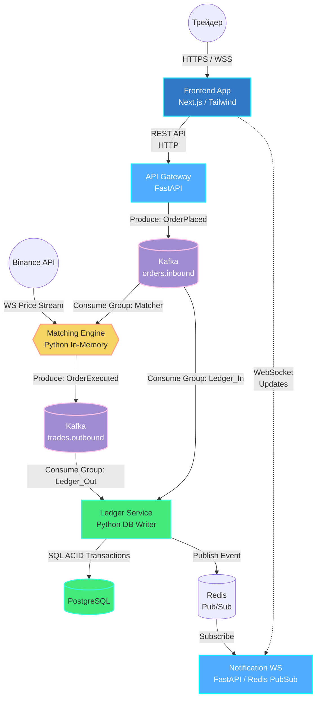

# ADR 000: Архитектура системы

**Дата:** 2026-06-23
**Автор:** Huan Jou

## Макро-архитектура: Симулятор биржевых торгов (High-Load Pet Project)

Стек технологий:

- Next.js (React)
- FastAPI (Python)
- Apache Kafka
- PostgreSQL
- Redis

**Архитектурный стиль: Microservices, Event-Driven, CQRS.**

## 1. Описание продукта

Проект представляет собой симулятор биржевых торгов.

## 2. Акторы (Внешние сущности)

- Трейдер (Пользователь): Авторизуется в системе, просматривает графики, выставляет ордера (Market, Limit, TP/SL), следит за портфелем.

- Провайдер рыночных данных (Binance WS/Finhub): Внешний источник истины для котировок в реальном времени. Поставляет поток цен для исполнения ордеров.

## 3. Архитектура Контейнеров (C4 Level 2)

Система разбита на независимые микросервисы. Каждый сервис выполняет строго одну бизнес-задачу (Single Responsibility) и может масштабироваться отдельно.

## 3.1. Описание микросервисов

- Frontend App (Next.js): SPA приложение. Отображает графики (TradingView Lightweight Charts), форму создания ордера, стакан (опционально) и историю сделок.

- API Gateway (FastAPI): Единая точка входа для всех REST запросов. Занимается авторизацией (JWT), валидацией тела запроса и проверкой бизнес-правил. Не пишет в PostgreSQL. Отправляет валидные команды (OrderPlaced) в Kafka.

- Matching Engine (Python Worker): Stateful-сервис. Не имеет REST API. Хранит отложенные ордера в памяти (Heaps). Слушает поток котировок Binance и поток новых заявок из Kafka.Генерирует события OrderExecuted.

- Ledger Service (Python Worker): Отвечает за целостность данных в БД (PostgreSQL). Параллельно слушает Kafka orders.inbound (чтобы записать ордер со статусом PENDING) и trades.outbound (чтобы перевести статус в EXECUTED и обновить балансы пользователя).

- Notification WS Server (FastAPI): Держит тысячи открытых WebSocket соединений с фронтендом. Когда Ledger Service обновляет базу, он кидает легковесный ивент в Redis Pub/Sub, который WS Server транслирует конкретному юзеру на фронтенд ("Ордер исполнен").

# 4. Отказаустойчивость

1. При падении торгового ядра, оно востонавливает свое состояние из журнала kafka
2. Состояние бд при падении также будет восстановленно из журнала kafka
