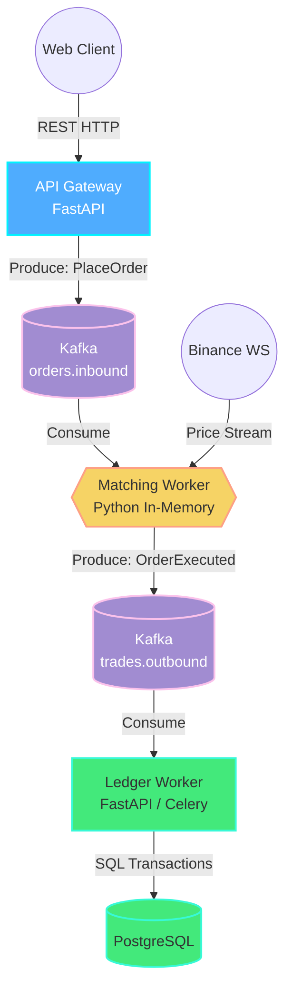
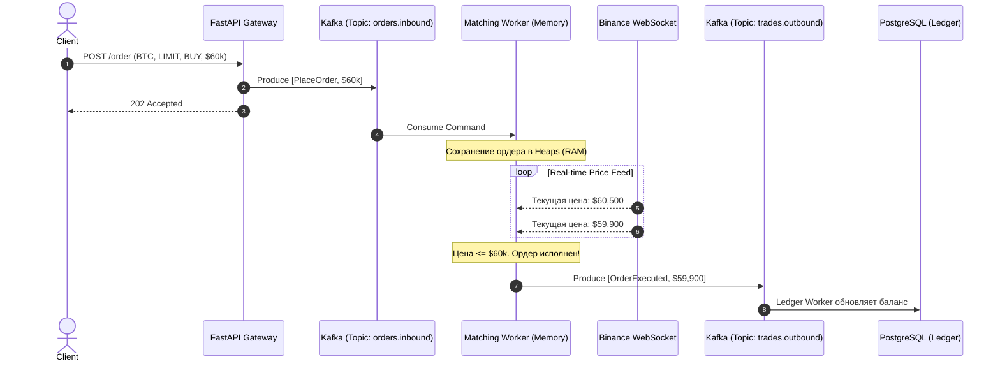

# ADR 001: Архитектура ядра симулятора торгов

**Дата:** 2026-06-23
**Автор:** Huan Jou

## 1. Границы и фокус

**Бизнес задачи**

- Исполнение Market и Limit ордеров на покупку и продажу
- Исполнение ликвидации сделок
- Исполнение TP/SL ордеров

**Бизнес ограничения**

- Не сохраняем в базу
- Не считаем комиссии
- Не отправляем уведомления о сделке пользователю

**Почему так?**
Наша задача исполить ордер с масимальной скоростью и обработать следующий, поэтому логи расчета, записи и уведомления будет делегирована на другие сервисы. Мы просто положим результат работы торгового движка в брокер сообщений.

## 2. Целевые метрики и SLA

**Пропускная способность** - 1000 сделок в секунду \
**Лимит задержки** - 1мс на 1 сделку\
**Требование к памяти** - <= 512 MB.

Обоснование: Один ордер в Python (dict/dataclass) весит около 150-200 байт. Для хранения 1,000,000 активных отложенных ордеров в оперативной памяти потребуется всего около 150-200 МБ. Это позволяет держать весь "Shadow Book" (книгу ордеров) в RAM обычного контейнера без использования внешних кэшей.

## 3. Топология и Стек (CQRS & Event-Driven)

Архитектура построена на паттерне CQRS. Горячий путь (Write Path) полностью изолирован от баз данных.
**Архитектурная схема компонентов (High-Level Design)**

**Поток выполнения ордера (Sequence Diagram)**

## 4. Структура данных и алгоритмы

Движок является Stateful-приложением. Для обеспечения молниеносного матчинга применяются структуры данных с минимальной асимптотической сложностью.

**Структуры в памяти**
Для каждой торговой пары (например, BTCUSDT) инициализируется изолированный объект состояния:

- Current_Price: Переменная (float/Decimal) с последней ценой от Оракула.

- Order_Map: Хеш-таблица (Hash Map). Ключ — Order_ID, значение — объект ордера.

- Price_Heaps: Две очереди с приоритетом (Priority Queues / Heaps):

- Max-Heap (Limit Buy & Stop Loss Sell): На вершине кучи всегда находится ордер с наибольшей ценой срабатывания.

- Min-Heap (Limit Sell & Take Profit Sell): На вершине кучи всегда находится ордер с наименьшей ценой срабатывания.

**Асимптотическая сложность**

- Размещение Market ордера: O(1). Сравниваем с Current_Price и сразу публикуем событие исполнения.
- Размещение отложенного ордера: O(log N). Вставка в Order_Map за O(1), добавление указателя в Heap за O(log N).
- Отмена ордера: O(1). Выполняется Soft Delete: помечаем флаг canceled=True в Order_Map. Heap удалит его "лениво" при достижении вершины.
- Тик рыночной цены: Амортизированное O(1). Сравнение новой цены происходит исключительно с вершиной кучи (Root node). Перебор всех ордеров исключен.

## 5. Отказоустойчивость и Hydration

Риск: Сбой Python-процесса (Crash/OOM/Деплой) приводит к полной потере In-Memory состояния (Heaps и Order_Map).

Решение (Event Sourcing): Благодаря использованию Apache Kafka в качестве персистентного журнала (Write-Ahead Log), движок не обращается к реляционной базе данных для восстановления.

При перезапуске процесс перематывает свой Offset в топике orders.inbound (до нулевой отметки или последнего Snapshot'а).

Выполняет In-Memory Replay исторических команд, восстанавливая идеальное состояние куч за доли секунды.

Возобновляет обработку новых ордеров без потери консистентности.
